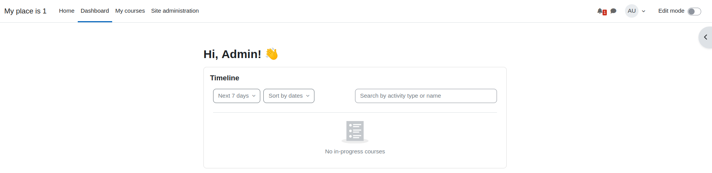
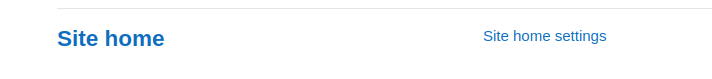

# Как поднять LMS

1. Скачиваем докер композ файл с офиц репозитория 
```bash
curl -sSL https://raw.githubusercontent.com/bitnami/containers/main/bitnami/moodle/docker-compose.yml > docker-compose.yml
sudo docker compose up -d
```

2. После того, как контейнеры поднялись идем по ссылке

http://<ip компьютера на котором развернули>:80

И нужно авторизоваться
Пользователь - user
Пароль - bitnami 

Далее будет такая менюшка



В разделе Home заполняем все необходимые окошки (они подсвечены красным значком) и внизу нажимаем на кнопку регистрации сайта

Нужно зайти в site administration и промотать в самый низ до панели Site Home

И в разделе Site home settings меняем "Full Site name" на номер своего места + меняем Short name 

Снова в site administration -> Uploud users
нажимаем на choose file и по пути нахождения файла в репе по итогу users.csv
CSV Ceparator на ";"
New user passw -> Field reueired file
Force ... -> None

Снова идем в раздел Users -> Нажимаем на "cohorts"
Создаем новую группу с помощью "Add new cohort" и по аналогии создаем группы согласно заданию по очереди (4 группы)

Около иени группы нажимаем на шестеренку и нажимаем на Assign, согласно заданию к каждой группе добавляем с помощью Add участников
